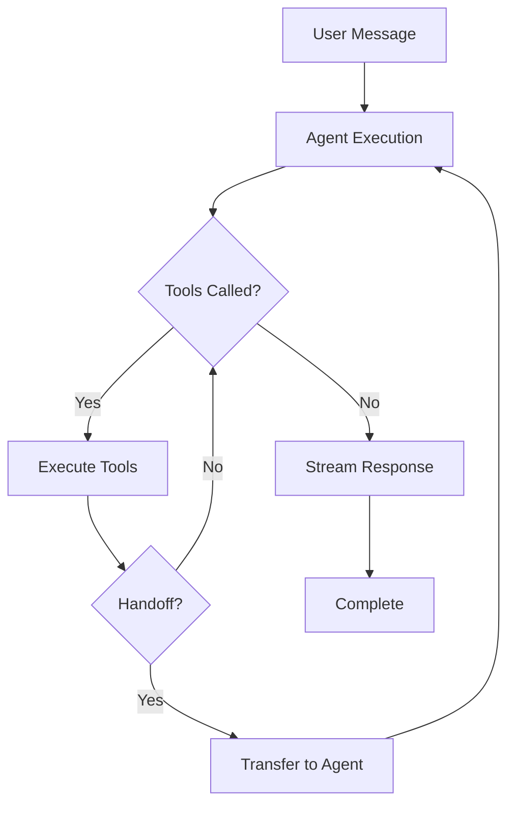

## What is an Agent?

An agent is an autonomous AI entity that:
- Receives instructions through prompts
- Uses tools to interact with systems
- Maintains context across interactions
- Delegates to specialized agents via handoffs
- Produces streaming or structured output

<CodeGroup>
```typescript Basic Agent
import { agent } from '@deepagents/agent';
import { openai } from '@ai-sdk/openai';

const assistant = agent({
  name: 'assistant',
  model: openai('gpt-4o'),
  prompt: 'You are a helpful assistant.',
});
```

```typescript With Tools
import { tool } from 'ai';
import { z } from 'zod';

const searchTool = tool({
  description: 'Search for information',
  parameters: z.object({
    query: z.string(),
  }),
  execute: async ({ query }) => {
    return await performSearch(query);
  },
});

const researcher = agent({
  name: 'researcher',
  model: openai('gpt-4o'),
  prompt: 'You research topics using available tools.',
  tools: { search: searchTool },
});
```

```typescript With Handoffs
const specialist = agent({
  name: 'specialist',
  model: openai('gpt-4o'),
  prompt: 'You handle specialized tasks.',
  handoffDescription: 'Handles complex analysis',
});

const coordinator = agent({
  name: 'coordinator',
  model: openai('gpt-4o'),
  prompt: 'You coordinate with specialists.',
  handoffs: [specialist],
});
```
</CodeGroup>

## Agent Configuration

The `agent()` function accepts a configuration object:

```typescript
interface CreateAgent<Output, CIn, COut> {
  // Required
  name: string;                    // Unique agent identifier
  model: LanguageModel;            // AI SDK language model
  prompt: Instruction<CIn>;        // String, array, or function
  
  // Optional
  tools?: ToolSet;                 // Available tools
  handoffs?: Agent[];              // Agents to delegate to
  handoffDescription?: string;     // Description for handoff tool
  output?: z.Schema<Output>;       // Structured output schema
  toolChoice?: ToolChoice;         // 'auto' | 'required' | 'none'
  temperature?: number;            // Model temperature
  prepareHandoff?: PrepareHandoffFn;  // Pre-handoff hook
  prepareEnd?: PrepareEndFn;       // Post-execution hook
}
```

### Name

The agent's unique identifier used in handoff tools and logging:

```typescript
const agent1 = agent({ name: 'researcher', /* ... */ });
const agent2 = agent({ name: 'writer', /* ... */ });

// Creates tools: transfer_to_researcher, transfer_to_writer
```

### Model

Any Vercel AI SDK compatible model:

```typescript
import { openai } from '@ai-sdk/openai';
import { anthropic } from '@ai-sdk/anthropic';
import { google } from '@ai-sdk/google';
import { groq } from '@ai-sdk/groq';

const agent1 = agent({ model: openai('gpt-4o'), /* ... */ });
const agent2 = agent({ model: anthropic('claude-sonnet-4-20250514'), /* ... */ });
const agent3 = agent({ model: google('gemini-1.5-pro'), /* ... */ });
const agent4 = agent({ model: groq('llama-3.3-70b-versatile'), /* ... */ });
```

### Prompt (Instructions)

Agents can receive instructions in multiple formats:

<Tabs>
  <Tab title="String">
    ```typescript
    const agent = agent({
      name: 'assistant',
      model: openai('gpt-4o'),
      prompt: 'You are a helpful assistant.',
    });
    ```
  </Tab>
  <Tab title="Array">
    ```typescript
    const agent = agent({
      name: 'assistant',
      model: openai('gpt-4o'),
      prompt: [
        'You are a helpful assistant.',
        'Always be concise.',
        'Cite sources when possible.',
      ],
    });
    ```
  </Tab>
  <Tab title="Function">
    ```typescript
    const agent = agent<unknown, { userId: string }>({
      name: 'assistant',
      model: openai('gpt-4o'),
      prompt: (ctx) => `You are helping user ${ctx?.userId}.`,
    });
    ```
  </Tab>
  <Tab title="Structured (instructions)">
    ```typescript
    import { instructions } from '@deepagents/agent';

    const agent = agent({
      name: 'assistant',
      model: openai('gpt-4o'),
      prompt: instructions({
        purpose: [
          'You coordinate research and writing tasks',
        ],
        routine: [
          'Analyze the user request',
          'Delegate to specialists as needed',
          'Synthesize results',
        ],
      }),
    });
    ```
  </Tab>
</Tabs>

<Note>
The `instructions()` helper creates structured prompts optimized for agent coordination.
</Note>

## Agent Lifecycle

Understanding the agent execution flow:

<Steps>
  <Step title="Initialization">
    Agent is created with configuration. Tools and handoffs are registered.
  </Step>
  <Step title="Execution Start">
    `execute()`, `generate()`, or `swarm()` is called with a message and context.
  </Step>
  <Step title="Prompt Assembly">
    The prompt is evaluated (if function) and combined with system instructions.
  </Step>
  <Step title="Model Invocation">
    The LLM is called with messages, tools, and configuration.
  </Step>
  <Step title="Tool Execution">
    If the model calls tools, they execute and results are fed back.
  </Step>
  <Step title="Handoff (Optional)">
    If a transfer tool is called, control moves to the target agent.
  </Step>
  <Step title="Response Streaming">
    Text chunks and tool calls are streamed to the caller.
  </Step>
  <Step title="Completion">
    Final response is assembled and context is updated.
  </Step>
</Steps>



## Design Patterns

### Single-Purpose Agents

Create agents with focused responsibilities:

```typescript
const summarizer = agent({
  name: 'summarizer',
  model: openai('gpt-4o'),
  prompt: 'Summarize text concisely, preserving key information.',
});

const translator = agent({
  name: 'translator',
  model: openai('gpt-4o'),
  prompt: 'Translate text accurately while preserving tone.',
});

const validator = agent({
  name: 'validator',
  model: openai('gpt-4o'),
  prompt: 'Validate data against provided schemas.',
});
```

### Coordinator Pattern

A single coordinator delegates to specialists:

```typescript
const researcher = agent({
  name: 'researcher',
  model: openai('gpt-4o'),
  prompt: 'Research topics thoroughly.',
  handoffDescription: 'Research facts and gather information',
});

const analyst = agent({
  name: 'analyst',
  model: openai('gpt-4o'),
  prompt: 'Analyze data and draw insights.',
  handoffDescription: 'Perform data analysis',
});

const writer = agent({
  name: 'writer',
  model: openai('gpt-4o'),
  prompt: 'Write clear, engaging content.',
  handoffDescription: 'Create written content',
});

const coordinator = agent({
  name: 'coordinator',
  model: openai('gpt-4o'),
  prompt: instructions({
    purpose: ['Coordinate task completion using specialists'],
    routine: [
      'Understand the user request',
      'Break down into subtasks',
      'Delegate to appropriate specialists',
      'Synthesize results',
    ],
  }),
  handoffs: [researcher, analyst, writer],
});
```

### Pipeline Pattern

Sequential processing through multiple agents:

```typescript
interface PipelineContext {
  originalText: string;
  summary?: string;
  translation?: string;
}

const summarizer = agent<unknown, PipelineContext>({
  name: 'summarizer',
  model: openai('gpt-4o'),
  prompt: 'Summarize the text concisely.',
});

const translator = agent<unknown, PipelineContext>({
  name: 'translator',
  model: openai('gpt-4o'),
  prompt: (ctx) => `Translate this summary to Spanish: ${ctx?.summary}`,
});

// Execute pipeline
const ctx: PipelineContext = { originalText: '...' };
const summary = await generate(summarizer, ctx.originalText, ctx);
ctx.summary = await summary.text;
const translation = await generate(translator, ctx.summary, ctx);
ctx.translation = await translation.text;
```

### Validation Pattern

Use structured output for validation:

```typescript
const validator = agent({
  name: 'validator',
  model: openai('gpt-4o'),
  prompt: 'Extract and validate contact information.',
  output: z.object({
    name: z.string(),
    email: z.string().email(),
    phone: z.string().regex(/^\+?[1-9]\d{1,14}$/),
    valid: z.boolean(),
    errors: z.array(z.string()),
  }),
});

const result = await generate(
  validator,
  'Contact: John Doe, john@example.com, +1234567890',
  {}
);

console.log(result.output);
// {
//   name: 'John Doe',
//   email: 'john@example.com',
//   phone: '+1234567890',
//   valid: true,
//   errors: []
// }
```

## Type Safety

Agents support full TypeScript inference:

```typescript
interface UserContext {
  userId: string;
  permissions: string[];
}

interface AdminContext extends UserContext {
  adminLevel: number;
}

const userAgent = agent<unknown, UserContext>({
  name: 'user_agent',
  model: openai('gpt-4o'),
  prompt: (ctx) => {
    // ctx is typed as UserContext | undefined
    return `User ${ctx?.userId} with permissions: ${ctx?.permissions.join(', ')}`;
  },
});

const adminAgent = agent<unknown, AdminContext>({
  name: 'admin_agent',
  model: openai('gpt-4o'),
  prompt: (ctx) => {
    // ctx is typed as AdminContext | undefined
    return `Admin level ${ctx?.adminLevel}`;
  },
});
```

## Best Practices

<CardGroup cols={2}>
  <Card title="Single Responsibility" icon="bullseye">
    Each agent should have one clear purpose
  </Card>
  <Card title="Clear Names" icon="tag">
    Use descriptive names like `researcher`, `code_reviewer`
  </Card>
  <Card title="Explicit Prompts" icon="file-lines">
    Provide detailed, specific instructions
  </Card>
  <Card title="Type Contexts" icon="code">
    Define TypeScript interfaces for context
  </Card>
  <Card title="Minimal Handoffs" icon="share-nodes">
    Avoid deep handoff chains (>3 levels)
  </Card>
  <Card title="Tool Documentation" icon="book">
    Write clear tool descriptions and parameters
  </Card>
</CardGroup>

## Anti-Patterns

<Warning>
Avoid these common mistakes:

- **God Agents** - Single agent with too many responsibilities
- **Circular Handoffs** - Agents that can delegate to each other
- **Vague Prompts** - Instructions that don't specify behavior
- **Missing Context Types** - Relying on `any` or untyped contexts
- **Tool Overload** - Giving an agent too many tools (>10)
</Warning>

## Next Steps

<CardGroup cols={2}>
  <Card title="Tools" icon="wrench" href="/concepts/tools">
    Learn about tool integration
  </Card>
  <Card title="Handoffs" icon="right-left" href="/concepts/handoffs">
    Master agent delegation
  </Card>
  <Card title="Context" icon="database" href="/concepts/context">
    Understand context management
  </Card>
  <Card title="Streaming" icon="water" href="/concepts/streaming">
    Implement streaming responses
  </Card>
</CardGroup>
