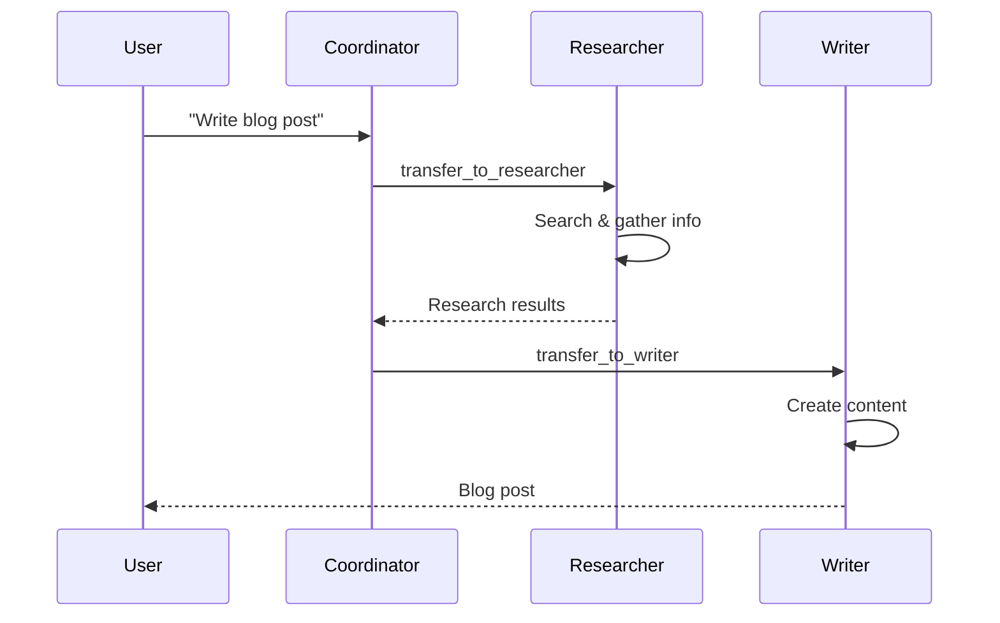

## What are Handoffs?

Handoffs allow agents to transfer control to other agents, enabling:
- Task delegation to specialists
- Multi-step workflows
- Hierarchical agent systems
- Dynamic routing based on expertise

When an agent has `handoffs`, it automatically receives `transfer_to_<agent_name>` tools.

## Basic Handoff

```typescript
import { agent, swarm } from '@deepagents/agent';
import { openai } from '@ai-sdk/openai';

const specialist = agent({
  name: 'specialist',
  model: openai('gpt-4o'),
  prompt: 'You handle specialized tasks.',
  handoffDescription: 'Handles complex analysis',
});

const coordinator = agent({
  name: 'coordinator',
  model: openai('gpt-4o'),
  prompt: 'You coordinate tasks and delegate to specialists.',
  handoffs: [specialist],
});

// Coordinator automatically gets transfer_to_specialist tool
const stream = swarm(coordinator, 'Analyze this data', {});
```

The LLM decides when to call `transfer_to_specialist` based on the task.

## Handoff Configuration

### handoffDescription

Describes when to use this agent:

```typescript
const researcher = agent({
  name: 'researcher',
  model: openai('gpt-4o'),
  prompt: 'You research topics thoroughly using available sources.',
  handoffDescription: 'Use for fact-finding, research, and information gathering',
  tools: { search: searchTool },
});

const coder = agent({
  name: 'coder',
  model: openai('gpt-4o'),
  prompt: 'You write and review code.',
  handoffDescription: 'Use for code generation, debugging, and code review',
  tools: { executeCode: codeTool },
});

const coordinator = agent({
  name: 'coordinator',
  model: openai('gpt-4o'),
  prompt: 'Delegate tasks to the appropriate specialist.',
  handoffs: [researcher, coder],
});
```

The coordinator sees:
- `transfer_to_researcher`: "Use for fact-finding, research, and information gathering"
- `transfer_to_coder`: "Use for code generation, debugging, and code review"

### prepareHandoff

Execute logic before transferring:

```typescript
const specialist = agent({
  name: 'specialist',
  model: openai('gpt-4o'),
  prompt: 'You are a specialist.',
  prepareHandoff: async (messages) => {
    console.log('Preparing to receive handoff');
    // Modify messages, log, update metrics, etc.
  },
});
```

### prepareEnd

Execute logic after agent completes:

```typescript
interface TaskContext {
  completedBy: string[];
}

const specialist = agent<unknown, TaskContext>({
  name: 'specialist',
  model: openai('gpt-4o'),
  prompt: 'You are a specialist.',
  prepareEnd: async ({ contextVariables, responseMessage }) => {
    contextVariables.completedBy.push('specialist');
    console.log('Specialist completed task');
  },
});
```

## Multi-Agent Patterns

### Sequential Specialists

Each specialist has distinct responsibilities:

```typescript
const researcher = agent({
  name: 'researcher',
  model: openai('gpt-4o'),
  prompt: 'Research topics and gather facts.',
  handoffDescription: 'Research and fact-finding',
  tools: { search: searchTool },
});

const analyst = agent({
  name: 'analyst',
  model: openai('gpt-4o'),
  prompt: 'Analyze data and draw insights.',
  handoffDescription: 'Data analysis and insights',
});

const writer = agent({
  name: 'writer',
  model: openai('gpt-4o'),
  prompt: 'Write clear, engaging content.',
  handoffDescription: 'Content creation and writing',
});

const coordinator = agent({
  name: 'coordinator',
  model: openai('gpt-4o'),
  prompt: instructions({
    purpose: ['Create comprehensive reports'],
    routine: [
      '1. Use researcher to gather facts',
      '2. Use analyst to analyze findings',
      '3. Use writer to create final report',
    ],
  }),
  handoffs: [researcher, analyst, writer],
});
```

### Nested Coordinators

Coordinators can delegate to other coordinators:

```typescript
const dataSpecialist = agent({
  name: 'data_specialist',
  model: openai('gpt-4o'),
  prompt: 'You handle data tasks.',
  handoffDescription: 'Data collection and processing',
});

const dataCoordinator = agent({
  name: 'data_coordinator',
  model: openai('gpt-4o'),
  prompt: 'Coordinate data operations.',
  handoffs: [dataSpecialist],
});

const contentSpecialist = agent({
  name: 'content_specialist',
  model: openai('gpt-4o'),
  prompt: 'You create content.',
  handoffDescription: 'Content creation',
});

const contentCoordinator = agent({
  name: 'content_coordinator',
  model: openai('gpt-4o'),
  prompt: 'Coordinate content creation.',
  handoffs: [contentSpecialist],
});

const mainCoordinator = agent({
  name: 'main_coordinator',
  model: openai('gpt-4o'),
  prompt: 'Route to data or content teams.',
  handoffs: [dataCoordinator, contentCoordinator],
});
```

<Warning>
Avoid deep nesting (>3 levels) as it increases latency and complexity.
</Warning>

### Conditional Handoffs

Create handoffs dynamically based on context:

```typescript
interface ProjectContext {
  projectType: 'web' | 'mobile' | 'data';
}

function createCoordinator(context: ProjectContext) {
  const handoffs = [];
  
  if (context.projectType === 'web') {
    handoffs.push(webSpecialist, frontendSpecialist);
  } else if (context.projectType === 'mobile') {
    handoffs.push(mobileSpecialist, iosSpecialist, androidSpecialist);
  } else {
    handoffs.push(dataSpecialist, mlSpecialist);
  }
  
  return agent({
    name: 'coordinator',
    model: openai('gpt-4o'),
    prompt: `Coordinate ${context.projectType} project tasks.`,
    handoffs,
  });
}
```

## Execution Flow

<Steps>
  <Step title="User sends message to coordinator">
    ```typescript
    swarm(coordinator, 'Write a blog post about AI', {});
    ```
  </Step>
  <Step title="Coordinator analyzes request">
    Determines that research is needed.
  </Step>
  <Step title="Coordinator calls transfer_to_researcher">
    Control transfers to the researcher agent.
  </Step>
  <Step title="Researcher executes">
    Uses search tool, gathers information, returns results.
  </Step>
  <Step title="Control returns to coordinator">
    Coordinator receives researcher's output.
  </Step>
  <Step title="Coordinator calls transfer_to_writer">
    Control transfers to the writer agent.
  </Step>
  <Step title="Writer creates content">
    Writes blog post based on research.
  </Step>
  <Step title="Final response streams to user">
    User receives completed blog post.
  </Step>
</Steps>



## Context Across Handoffs

Context variables persist across agent transitions:

```typescript
interface WorkflowContext {
  userId: string;
  steps: string[];
  results: Record<string, any>;
}

const researcher = agent<unknown, WorkflowContext>({
  name: 'researcher',
  model: openai('gpt-4o'),
  prompt: (ctx) => `Research for user ${ctx?.userId}`,
  prepareEnd: async ({ contextVariables, responseMessage }) => {
    contextVariables.steps.push('research');
    contextVariables.results.research = 'Research findings...';
  },
});

const writer = agent<unknown, WorkflowContext>({
  name: 'writer',
  model: openai('gpt-4o'),
  prompt: (ctx) => {
    const research = ctx?.results.research || '';
    return `Write content based on: ${research}`;
  },
  prepareEnd: async ({ contextVariables }) => {
    contextVariables.steps.push('writing');
    contextVariables.results.content = 'Final content...';
  },
});

const coordinator = agent<unknown, WorkflowContext>({
  name: 'coordinator',
  model: openai('gpt-4o'),
  prompt: 'Coordinate workflow.',
  handoffs: [researcher, writer],
});

const ctx: WorkflowContext = {
  userId: 'user123',
  steps: [],
  results: {},
};

const stream = swarm(coordinator, 'Create a report', ctx);
await stream.text;

console.log(ctx.steps); // ['research', 'writing']
console.log(ctx.results); // { research: '...', content: '...' }
```

## Swarm vs Execute

### `swarm()`

Optimized for handoffs:

```typescript
import { swarm } from '@deepagents/agent';

const stream = swarm(
  coordinator,
  'Complete this task',
  context,
  abortSignal
);
```

- Automatically handles agent transfers
- Maintains conversation history across handoffs
- Returns unified text stream
- Supports abort signals

### `execute()`

Lower-level execution:

```typescript
import { execute } from '@deepagents/agent';

const stream = execute(
  agent,
  messages,
  context,
  { maxSteps: 10 }
);
```

- Full control over execution
- Custom step limits
- Access to tool calls and deltas
- Use when you need fine-grained control

<Note>
Use `swarm()` for multi-agent systems and `execute()` for single-agent or custom control flow.
</Note>

## Instructions Helper

The `instructions()` function creates structured prompts for coordination:

```typescript
import { instructions } from '@deepagents/agent';

const coordinator = agent({
  name: 'coordinator',
  model: openai('gpt-4o'),
  prompt: instructions({
    purpose: [
      'You coordinate software development tasks',
      'Break down complex problems',
      'Delegate to specialized agents',
    ],
    routine: [
      '1. Analyze the user request',
      '2. Break into subtasks',
      '3. Identify required specialists',
      '4. Delegate using transfer_to_<agent> tools',
      '5. Synthesize results',
      '6. Present final output to user',
    ],
  }),
  handoffs: [/* specialists */],
});
```

For swarm-specific prompts:

```typescript
const coordinator = agent({
  name: 'coordinator',
  model: openai('gpt-4o'),
  prompt: instructions.swarm({
    purpose: ['Coordinate specialist agents'],
    routine: ['Delegate appropriately', 'Synthesize results'],
  }),
  handoffs: [/* specialists */],
});
```

## Best Practices

<CardGroup cols={2}>
  <Card title="Clear Descriptions" icon="file-lines">
    Write specific handoffDescription for each agent
  </Card>
  <Card title="Single Coordinator" icon="sitemap">
    Use one coordinator per swarm level
  </Card>
  <Card title="Typed Context" icon="code">
    Define TypeScript interfaces for context
  </Card>
  <Card title="Shallow Hierarchies" icon="layer-group">
    Avoid deep nesting (>3 levels)
  </Card>
  <Card title="Explicit Routing" icon="route">
    Provide clear routing instructions
  </Card>
  <Card title="Context Cleanup" icon="broom">
    Clean up context in prepareEnd hooks
  </Card>
</CardGroup>

## Anti-Patterns

<Warning>
Avoid these common mistakes:

- **Circular Handoffs** - Agent A hands to B, B hands back to A
- **Too Many Handoffs** - More than 5 specialists per coordinator
- **Vague Descriptions** - Generic handoffDescription values
- **Missing Coordinator** - Specialists handing off to each other
- **Deep Nesting** - 4+ levels of coordinators
</Warning>

## Next Steps

<CardGroup cols={2}>
  <Card title="Context Management" icon="database" href="/concepts/context">
    Learn about context variables
  </Card>
  <Card title="Streaming" icon="water" href="/concepts/streaming">
    Handle streaming responses
  </Card>
  <Card title="Agent Package" icon="robot" href="/packages/agent">
    Full API reference
  </Card>
</CardGroup>
